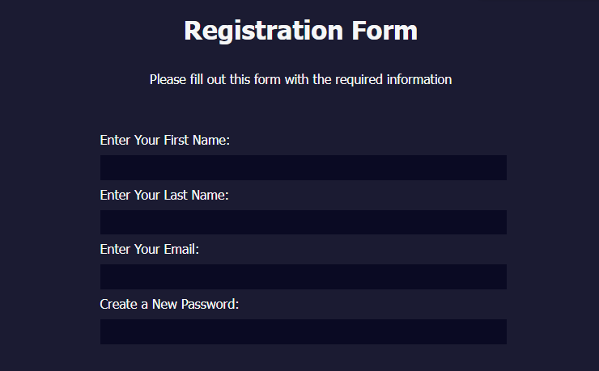

# Formulário de Registro

Um formulário simples de registro criado como um projeto do curso de Responsive Web Design do freeCodeCamp.

## Como Usar

1.  Faça o download dos arquivos HTML e CSS deste repositório.
2.  Certifique-se de que o arquivo styles.css esteja na mesma pasta do arquivo HTML.
3.  Abra o arquivo index.html no seu navegador web.
4.  Preencha o formulário com as informações solicitadas.
5.  Clique no botão "Submit" para enviar o formulário.

Observação: O arquivo styles.css é necessário para o correto funcionamento do formulário. Certifique-se de que ele esteja presente na mesma pasta do arquivo HTML.

## Screenshot

## Funcionalidades

Este formulário de registro apresenta as seguintes funcionalidades:

- Requer campos obrigatórios preenchidos, incluindo nome, sobrenome, e-mail, senha, tipo de conta e aceitação dos termos e condições.
- Usa HTML5 para validação do formulário, incluindo validação de e-mail e senha.
- Permite ao usuário selecionar entre uma conta pessoal ou empresarial.
- Permite ao usuário fazer upload de uma imagem de perfil e adicionar uma bio.
- Inclui um campo para selecionar como o usuário ouviu falar do freeCodeCamp.
- Inclui uma limitação de idade mínima de 13 anos para o registro.

## Autor

- Nome: Lucas Bomfim Fernandes
- Email: lucadez01@gmail.com
- LinkedIn: https://www.linkedin.com/in/lucasbomfim10
