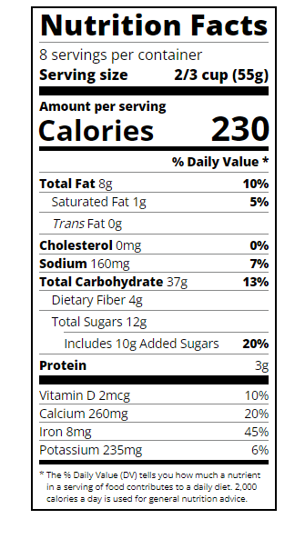

# Nutrition Label

Este projeto foi feito no curso Responsive Web Design do freeCodeCamp e consiste em uma galeria de fotos usando Typography com css e html. 

## Como usar

1. Faça o download do repositório.
2. Abra o arquivo `index.html` em seu navegador.
3. Nutrition Label será exibida na página.

## Screenshot

## Funcionalidades

A etiqueta de nutrição apresenta informações nutricionais de um alimento, incluindo informações como quantidade de calorias, quantidade de gorduras, carboidratos, proteínas e porcentagem de valores diários.

## Autor

- Nome: Lucas Bomfim Fernandes
- Email: lucadez01@gmail.com
- LinkedIn: https://www.linkedin.com/in/lucasbomfim10/
