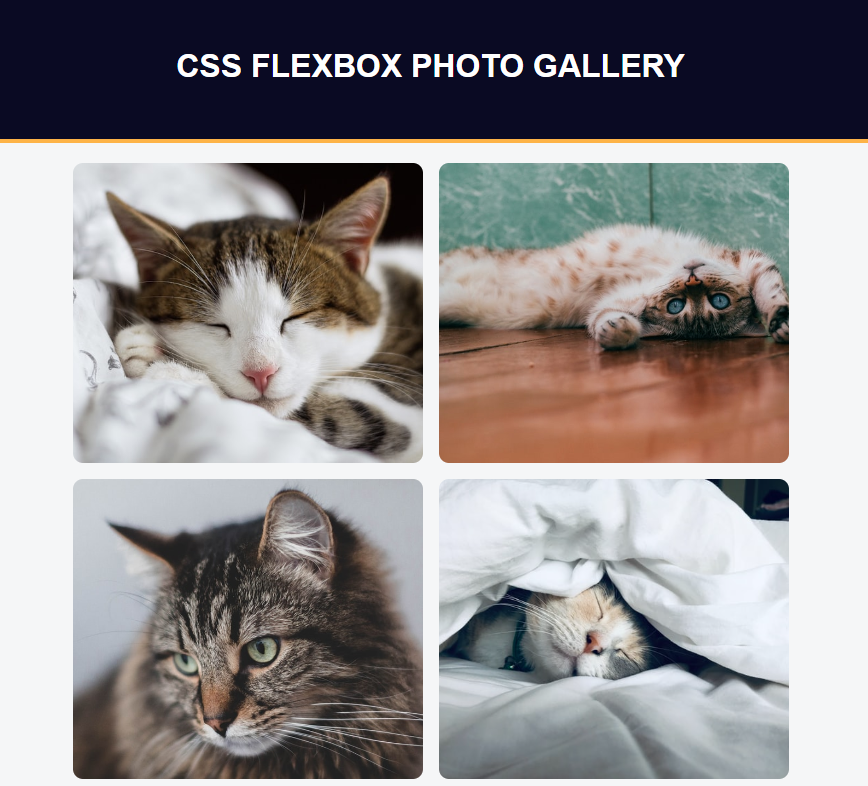

# Photo Gallery

Este projeto foi feito no curso Responsive Web Design do freeCodeCamp e consiste em uma galeria de fotos usando flexbox. 

## Como usar

1. Faça o download do repositório.
2. Abra o arquivo `index.html` em seu navegador.
3. A galeria de fotos será exibida na página.

## Screenshot

## Funcionalidades

- Galeria de fotos com layout responsivo
- Imagens com tamanhos e proporções diferentes
- Uso de flexbox para organizar as imagens
- Design simples e elegante

## Autor

- Nome: Lucas Bomfim Fernandes
- Email: lucadez01@gmail.com
- LinkedIn: https://www.linkedin.com/in/lucasbomfim10/

