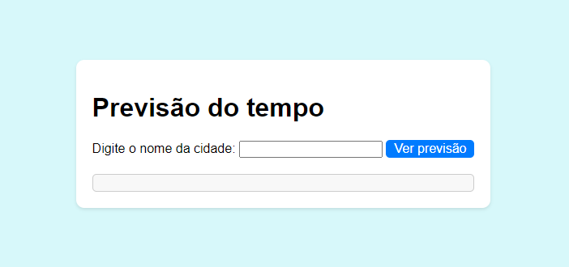

# Previsão do Tempo

Este é um projeto simples de previsão do tempo, onde o usuário pode inserir o nome de uma cidade e verificar a temperatura e a descrição do tempo para essa cidade.

## Como funciona

1. Abra o arquivo `index.html` em um navegador da web.
2. Digite o nome da cidade desejada no campo de entrada e clique no botão "Ver previsão".
3. A previsão do tempo para a cidade será exibida logo abaixo do botão, mostrando a temperatura em graus Celsius e uma descrição do tempo.

## Requisitos

Para executar este projeto, você precisará de uma chave de API válida da OpenWeatherMap. Essa chave é necessária para fazer a solicitação à API de previsão do tempo.

## Configuração da chave de API

Para configurar sua chave de API, siga estas etapas:

1. Acesse o site da [OpenWeatherMap](https://openweathermap.org/) e crie uma conta (se ainda não tiver uma).
2. Faça login em sua conta da OpenWeatherMap e vá para o [Painel de controle](https://home.openweathermap.org/users/sign_in).
3. Clique em "API Keys" no menu à esquerda e clique em "Generate" para gerar uma nova chave de API.
4. Copie a chave de API gerada.

## Configuração do projeto

1. Clone este repositório em seu computador.
2. Abra o arquivo `script.js` na pasta raiz e substitua o valor da variável `apiKey` pela sua chave de API.

```
const apiKey = "sua_api_key_aqui";
```

4. Salve o arquivo.

## Como executar o projeto

1. Abra um terminal ou prompt de comando na pasta raiz do projeto.
2. Certifique-se de ter o Node.js instalado em seu computador.
3. Execute o seguinte comando para instalar as dependências do projeto:

```
npm install
```

4. Após a instalação das dependências, execute o seguinte comando para iniciar o servidor:

```
node server.js
```

5. O servidor será iniciado na porta 3000. Abra um navegador da web e acesse `http://localhost:3000` para visualizar o projeto.

## Personalização do estilo

O projeto possui um arquivo `style.css` na pasta raiz, onde você pode personalizar o estilo da página de acordo com suas preferências. Sinta-se à vontade para modificar as cores, fontes e layout para deixar a experiência mais agradável.


